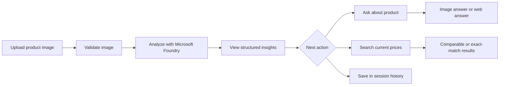
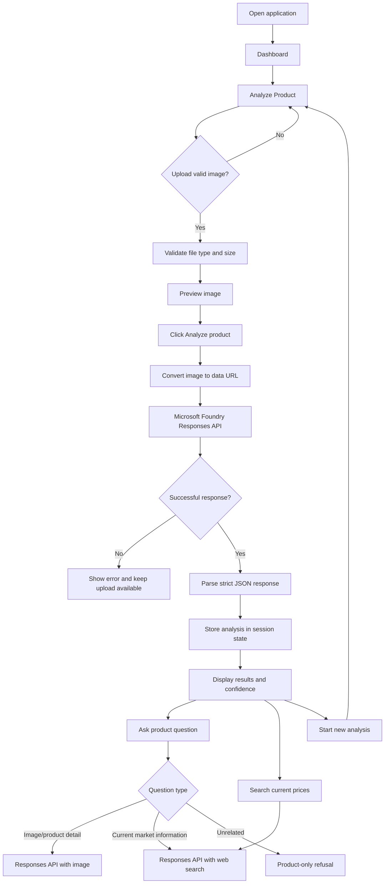
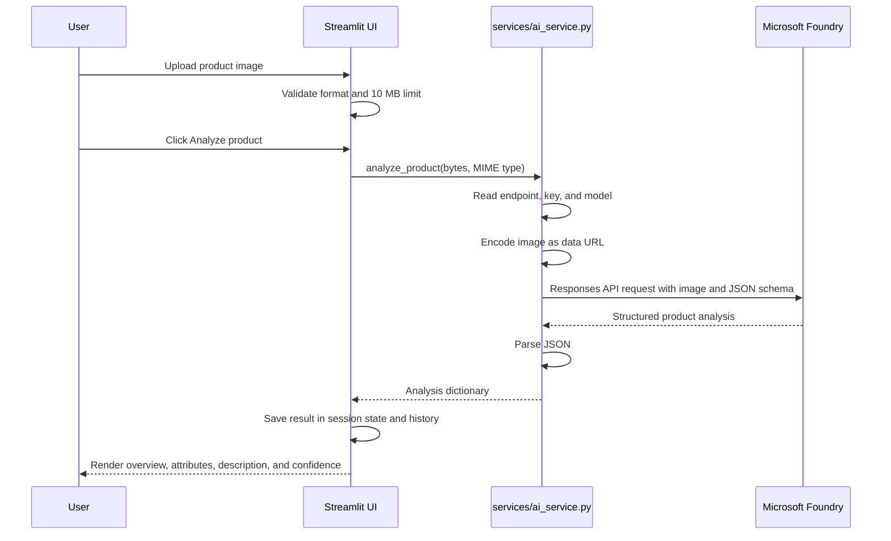
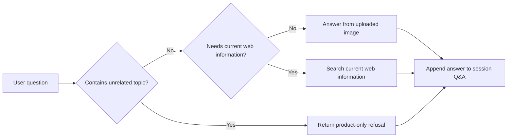
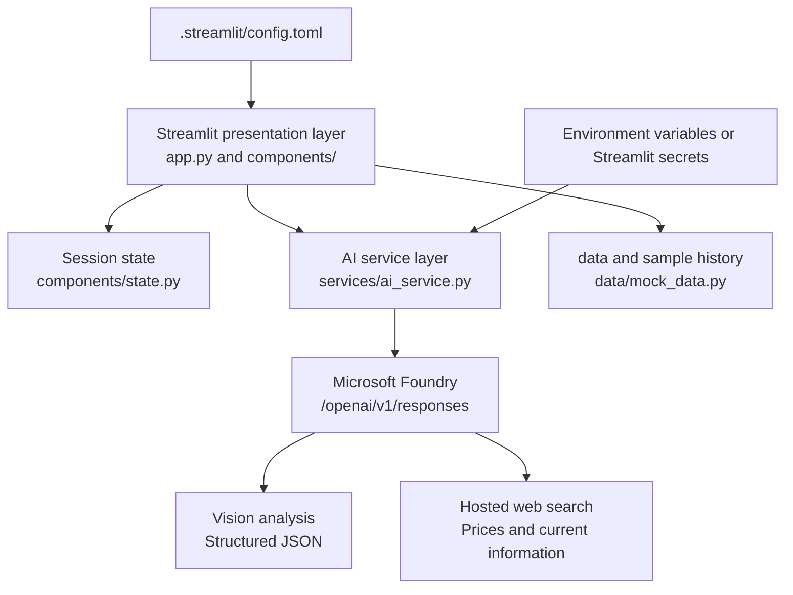

# AI Product Visualizer

AI Product Visualizer is a dark-themed Streamlit application that turns a product image into structured product insights. It uses the Microsoft Foundry Responses API through the OpenAI-compatible Python client and keeps API credentials on the server side.

The application can:

- Analyze a JPG, JPEG, PNG, or WebP product image.
- Identify visible details such as category, color, material, style, brand, model number, variant, and visible specifications.
- Generate an AI-written product description and confidence score.
- Show visual attributes, confidently identified details, and information that cannot be determined from the image.
- Answer questions about the uploaded product using image analysis.
- Search current prices and comparable products using web search.
- Preserve analyses in the current Streamlit session's history.

> Never commit `.env`, `.streamlit/secrets.toml`, API keys, or other credentials to source control.

## Contents

- [How the application works](#how-the-application-works)
- [Workflow](#workflow)
- [Architecture](#architecture)
- [Project structure](#project-structure)
- [Requirements](#requirements)
- [Run locally](#run-locally)
- [Configuration and secrets](#configuration-and-secrets)
- [Using the application](#using-the-application)
- [Analysis response contract](#analysis-response-contract)
- [Responsible AI and Azure services](#responsible-ai-and-azure-services)
- [Deploy to Streamlit Community Cloud](#deploy-to-streamlit-community-cloud)
- [Troubleshooting](#troubleshooting)
- [Development guide](#development-guide)
- [Limitations and safe-use notes](#limitations-and-safe-use-notes)

## Quick workflow



## How the application works

The application has four main user areas:

| Area | Purpose |
| --- | --- |
| Dashboard | Entry point with an overview of the product-analysis workflow and recent analyses. |
| Analyze Product | Accepts an image upload, validates it, and sends it to Microsoft Foundry. |
| Results | Displays structured analysis, identity fields, attributes, confidence, description, and price search. |
| History | Shows analyses stored in the current user session and allows an earlier result to be reopened. |

The question panel is available below an analysis. It classifies questions before sending them to the model:

- Questions about visible product details use the uploaded image.
- Price, availability, retailer, comparison, and similar-product questions use web search.
- Unrelated questions are rejected with a product-only response.

## Workflow

### End-to-end user workflow



### Analysis workflow



### Question-routing workflow



## Architecture



### Main components

- `app.py` initializes the page, injects the theme, renders navigation, and routes between pages.
- `components/` contains the UI layer, page sections, session state, styling, upload flow, results, history, and Q&A.
- `services/ai_service.py` is the integration boundary for Microsoft Foundry. It contains image analysis, image-based Q&A, product-price search, and web Q&A.
- `data/mock_data.py` contains sample data used to populate the initial experience and documents the expected UI data shape.
- `.streamlit/config.toml` defines the theme, upload limit, toolbar behavior, and error-detail setting.

## Project structure

```text
ai-product-visualizer/
├── app.py                         # Streamlit entry point
├── requirements.txt               # Python dependencies
├── README.md                      # This guide
├── .gitignore                     # Excludes secrets and local environments
├── .streamlit/
│   └── config.toml                # Theme and Streamlit server settings
├── components/
│   ├── about.py                   # About page
│   ├── dashboard.py               # Dashboard page
│   ├── header.py                  # Shared page header
│   ├── history.py                 # Session history page
│   ├── media.py                   # Image and media helpers
│   ├── qa.py                      # Product Q&A and question routing
│   ├── results.py                 # Analysis results and price search
│   ├── sidebar.py                 # Navigation and theme controls
│   ├── state.py                   # Session-state initialization/reset
│   ├── theme.py                   # Design tokens and UI helpers
│   └── upload.py                  # Upload, validation, and analysis trigger
├── data/
│   ├── __init__.py
│   └── mock_data.py               # Sample data and history records
└── services/
    ├── __init__.py
    └── ai_service.py              # Microsoft Foundry API integration
```

## Requirements

- Python 3.10 or newer.
- A Microsoft Foundry project with a vision-capable model deployment.
- A Microsoft Foundry project endpoint and API key.
- The model name used by the Foundry project.
- Network access from the deployment environment to the Foundry endpoint.

Python packages are listed in [`requirements.txt`](requirements.txt): `streamlit`, `pillow`, `openai`, and `python-dotenv`.

## Run locally

Open a terminal in the folder containing `app.py`.

### Windows PowerShell

```powershell
python -m venv .venv
.\.venv\Scripts\Activate.ps1
python -m pip install --upgrade pip
pip install -r requirements.txt
streamlit run app.py
```

### macOS or Linux

```bash
python3 -m venv .venv
source .venv/bin/activate
python -m pip install --upgrade pip
pip install -r requirements.txt
streamlit run app.py
```

The default local URL is `http://localhost:8501`. To use a different port:

```bash
streamlit run app.py --server.port 8502
```

## Configuration and secrets

### Local development with `.env`

Create a local `.env` file beside `app.py`:

```env
FOUNDRY_PROJECT_ENDPOINT=https://your-resource.services.ai.azure.com/api/projects/your-project
FOUNDRY_API_KEY=your_api_key
FOUNDRY_MODEL=gpt-4.1-mini
```

The application loads this file using `python-dotenv`. The `.env` file is ignored by Git and must remain local.

### Variable reference

| Variable | Required | Description |
| --- | --- | --- |
| `FOUNDRY_PROJECT_ENDPOINT` | Yes | Microsoft Foundry project endpoint. The service appends `/openai/v1` when needed. |
| `FOUNDRY_API_KEY` | Yes | API key used by the server to authenticate with Foundry. |
| `FOUNDRY_MODEL` | Yes | Model deployment name, for example `gpt-4.1-mini`. |

### Streamlit secrets

For hosts that use Streamlit secrets, create `.streamlit/secrets.toml` locally only when needed:

```toml
FOUNDRY_PROJECT_ENDPOINT = "https://your-resource.services.ai.azure.com/api/projects/your-project"
FOUNDRY_API_KEY = "your_api_key"
FOUNDRY_MODEL = "gpt-4.1-mini"
```

Do not commit this file. It is already excluded by `.gitignore`.

## Using the application

### 1. Upload an image

1. Open **Analyze Product**.
2. Upload one product image.
3. Use a clear image with one product, good lighting, and minimal occlusion.
4. Keep the file at or below 10 MB.
5. Review the preview and click **Analyze product**.

### 2. Review the analysis

The results page contains:

- Product overview.
- Editable product identity fields.
- AI confidence label and score.
- Colors, material, shape, style, and features.
- Generated product description.
- Details confidently identified by the model.
- Details the model cannot determine from the image.

The identity fields can be corrected before running a market search. This is especially important when a brand, product name, variant, or model number is uncertain.

### 3. Search current prices

1. Review or correct the identity fields.
2. Enter the market or location, which defaults to `India`.
3. Click **Search current prices**.

If brand, product name, and model number are present, the app requests an exact-match search. Otherwise, results are treated as comparable products rather than confirmed matches.

### 4. Ask a question

Use the Q&A section below the results. Questions about appearance and visible attributes are answered from the uploaded image. Questions involving price, availability, retailers, comparisons, or similar products are routed through web search.

The application intentionally refuses unrelated topics such as programming, homework, politics, sports, recipes, and song lyrics.

### 5. Start over or reopen history

- Click **New analysis** to clear the active result and upload another image.
- Open **History** to reopen an earlier result from the current session.
- History is stored in Streamlit session state; it is not a permanent database.

## Analysis response contract

The Foundry vision request uses a strict JSON schema. The expected top-level response is:

```json
{
  "overview": {
    "Category": "string",
    "Product Type": "string",
    "Primary Color": "string",
    "Material": "string",
    "Style": "string"
  },
  "identity": {
    "brand": "string",
    "product_name": "string",
    "model_number": "string",
    "variant": "string",
    "specifications": ["string"]
  },
  "attributes": {
    "Colors": [{"name": "string", "hex": "#000000"}],
    "Material": ["string"],
    "Shape": ["string"],
    "Style": ["string"],
    "Features": ["string"]
  },
  "description": "string",
  "confidence": {"label": "string", "score": 0},
  "confidently_identified": ["string"],
  "cannot_determine": ["string"]
}
```

The schema and prompt are defined in `services/ai_service.py`. If the response contract changes, update the schema and result renderer together.

## Responsible AI and Azure services

This project is designed to provide useful product insights while making uncertainty visible and limiting the system to its intended purpose. The responsible-AI controls are implemented across the application prompt, response schema, question router, and market-search presentation.

### Guardrails currently implemented

| Guardrail | Implementation | User benefit |
| --- | --- | --- |
| Evidence-only analysis | The Foundry system instruction tells the model to report only what can reasonably be determined from the image. | Reduces invented specifications, dimensions, model numbers, brand details, and performance claims. |
| Explicit uncertainty | The response schema includes `cannot_determine`; unreadable model numbers must be returned as empty instead of guessed. | Makes missing or uncertain information visible. |
| Confidence display | Every analysis includes a confidence label and a score from 0 to 100. | Helps users judge how much to rely on the result. |
| Product-only Q&A | The application filters unrelated topics such as programming, homework, politics, sports, recipes, and lyrics. | Keeps the assistant within its intended product-analysis scope. |
| Separate image and web reasoning | Visible product questions use the uploaded image; current price and availability questions use web search. | Reduces confusion between visual evidence and changing market information. |
| Exact-match protection | A market search is marked as exact only when brand, product name, and model number are available. Otherwise results are labeled comparable or not exact. | Prevents similar products from being presented as the identified product. |
| Input validation | Uploads are limited to supported image formats and 10 MB. | Reduces malformed input and resource-abuse risk. |
| Secret protection | API credentials are loaded from local environment variables or deployment secrets and are excluded from Git. | Keeps credentials out of source code and the user interface. |

### Microsoft Azure and Foundry capabilities used

The application uses a Microsoft Foundry project endpoint through the OpenAI-compatible Responses API:

```text
{FOUNDRY_PROJECT_ENDPOINT}/openai/v1/responses
```

The configured Azure service capabilities are:

1. **Microsoft Foundry project endpoint** — provides the project-scoped model access and authentication boundary.
2. **Vision-capable Foundry model** — analyzes the uploaded product image and returns the strict structured JSON contract documented above.
3. **Responses API structured output** — constrains analysis responses to the required schema.
4. **Hosted web search tool** — supports current price, retailer, availability, and comparable-product questions.

The integration is centralized in `services/ai_service.py`. The application does not expose the API key to the browser.

### Responsible-use expectations

AI output should be treated as an assistive estimate, not as proof of identity, authenticity, safety, compliance, warranty, or technical specifications. Users should verify important information against the manufacturer or retailer, especially before making a purchase or safety-related decision. Current prices and availability can change after a result is generated.

The current repository implements application-level guardrails and Foundry prompt/schema controls. A separate Azure AI Content Safety moderation call is not currently wired into the codebase; it should be added if the product is expanded to accept free-form user content or support higher-risk use cases.

## Deploy to Streamlit Community Cloud

The repository is ready for Streamlit Community Cloud. The repository root should contain `app.py`, `requirements.txt`, `.streamlit/config.toml`, `components/`, `data/`, and `services/`.

1. Push the project to GitHub.
2. Open [Streamlit Community Cloud](https://share.streamlit.io/).
3. Select **Create app**.
4. Choose the GitHub repository and the `main` branch.
5. Set the main file to `app.py`.
6. Open **Advanced settings**.
7. Set the Python version used by your local environment, preferably Python 3.12 for a new deployment.
8. Add the following to the **Secrets** field:

   ```toml
   FOUNDRY_PROJECT_ENDPOINT = "https://your-resource.services.ai.azure.com/api/projects/your-project"
   FOUNDRY_API_KEY = "your_api_key"
   FOUNDRY_MODEL = "gpt-4.1-mini"
   ```

9. Click **Deploy**.

Streamlit Cloud installs dependencies from `requirements.txt` and keeps values entered in the Secrets field outside the repository. If the app is inside a subdirectory, select that subdirectory's `app.py` and ensure the dependency file is either at the repository root or beside the entry point.

## Troubleshooting

### `FOUNDRY_API_KEY is missing`

Confirm that all three variables are present in your local `.env` or deployment secrets. Restart the Streamlit process after changing secrets.

### `Could not analyze the image`

Check that the Foundry endpoint is correct, the API key can access the project, the model deployment name matches `FOUNDRY_MODEL`, the model supports image input and structured Responses API output, and the deployment environment can reach the endpoint.

### `Foundry returned invalid analysis JSON`

The model did not satisfy the strict response schema. Verify that the configured model supports structured JSON output and inspect the model/deployment configuration before changing the UI contract.

### Price search fails

Price search requires a model and Foundry configuration that support the hosted `web_search` tool. Confirm that web search is enabled for the project and that the deployment has outbound network access.

### The app cannot find modules such as `components` or `services`

Run Streamlit from the project directory containing `app.py`, or configure the deployment entry point to use that directory. Do not run the command from the parent workspace if the project is nested.

### Uploads are rejected

The application accepts JPG, JPEG, PNG, and WebP files up to 10 MB. The limit is configured in both `components/upload.py` and `.streamlit/config.toml`; keep those values aligned if the limit changes.

## Development guide

### Add or change a page

1. Add a renderer in `components/`.
2. Add its page name and heading in `app.py`.
3. Add navigation behavior in `components/sidebar.py` if needed.
4. Keep per-user values in `st.session_state`, initialized in `components/state.py`.

### Change the Foundry integration

Keep external API calls inside `services/ai_service.py`. The UI should call service functions rather than constructing API clients directly. This keeps credentials, endpoint normalization, prompts, schemas, and error handling in one place.

### Change the analysis schema

Update all of the following together:

1. `ANALYSIS_SCHEMA` in `services/ai_service.py`.
2. `ANALYSIS_INSTRUCTIONS` if the model needs new guidance.
3. `components/results.py` to render the new fields.
4. `data/mock_data.py` if sample data is used for the new field.
5. This README's [analysis response contract](#analysis-response-contract).

### Local checks

```bash
python -m compileall app.py components data services
streamlit run app.py
```

Before opening a pull request, verify that no `.env` or secrets file is staged, upload and analysis work, Q&A and price search work, history and reset work, and schema changes are reflected in the UI and documentation.

## Limitations and safe-use notes

- The model can only infer information visible in the uploaded image. It should not be treated as an authoritative source for hidden specifications, authenticity, safety, warranty, or legal claims.
- A readable model number is required for a reliable exact-match market search. If it is missing or uncertain, the application labels results as comparable products.
- Price and availability information changes over time and can vary by location, taxes, shipping, seller, and condition.
- Uploaded image bytes and analysis state are held in the active Streamlit session. The application does not provide durable database storage.
- API keys are server-side configuration values. Never print them, expose them in the UI, commit them, or include them in screenshots or logs.

## License

No license has been specified for this repository. Add a license file before distributing or reusing the project outside its intended environment.
